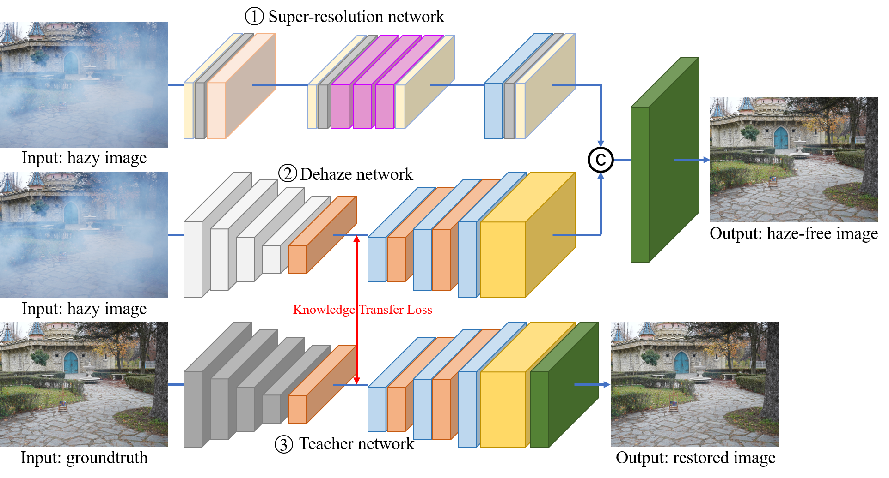

## Super Resolution Knowledge Transfer Network

### Network Structure

<div style="text-align:center"><br/></div>

### Dependencies

- Python 3.7
- PyTorch >= 1.7
- CUDA

### Test

Load images from *dirname* and store output in *output_dir* (output to current directory by default). 

```
python test.py dirname [output_dir]
```

### Pretrained model

Baidu Net Disk: https://pan.baidu.com/s/1JRVRH4oehT_P7MVFCvwMrA (Extract password: **srkt**)

